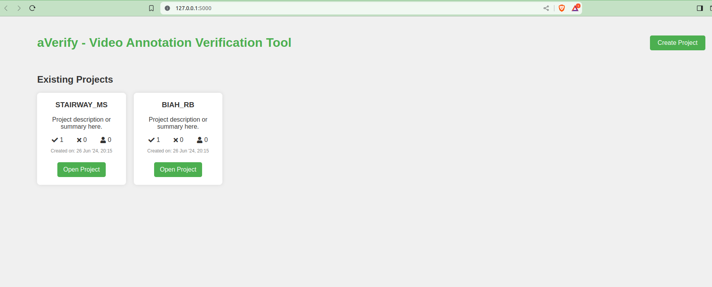
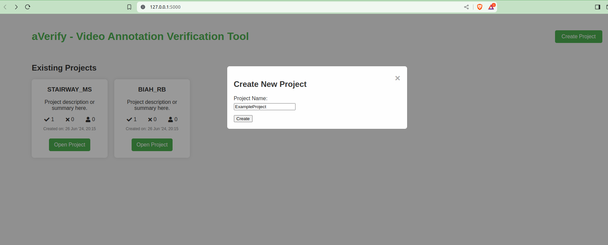
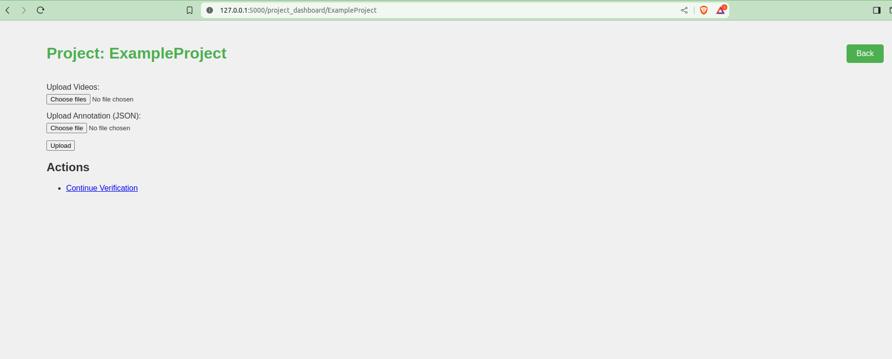
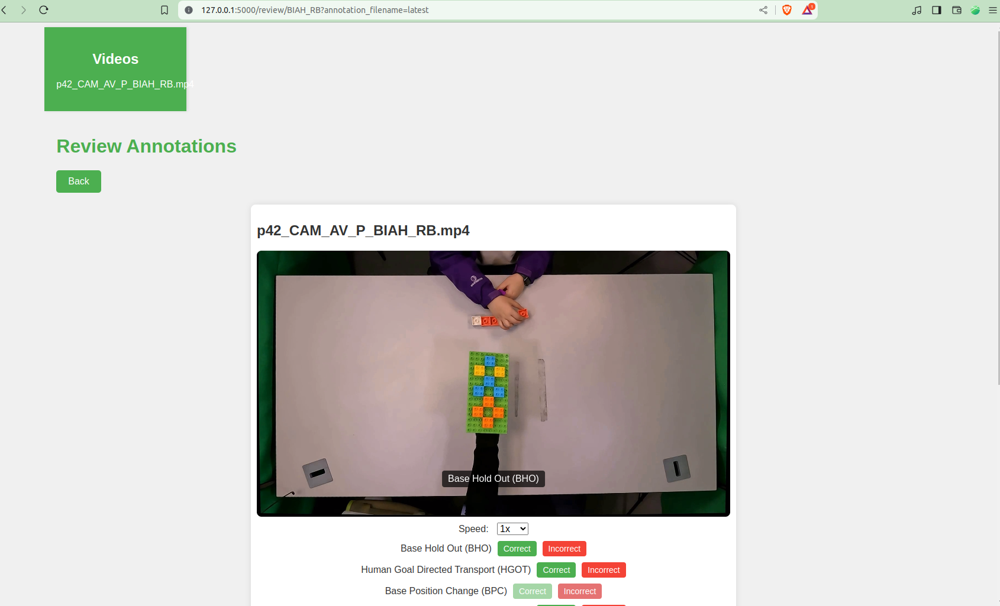
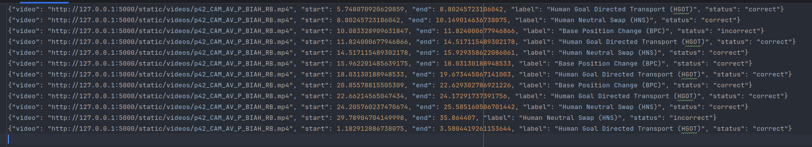

# AnnotateVerify
review and verify video annotations
requires: Python 3.6 or later and Flask 1.1.2 or later

AnnotateVerify is a browser-based tool for reviewing and verifying video annotations done using [Label Studio](https://labelstud.io/). Users can upload videos and corresponding JSON annotation files, review video segments, and confirm or reject assigned labels. Incorrect labels are logged for further analysis.

## Features

- **Video Playback with Annotations**: Play video segments with captions displaying the assigned labels.
- **Verification Buttons**: Provide "Correct" and "Incorrect" buttons for users to confirm or reject labels.
- **Logging Incorrect Labels**: Log incorrect labels with timestamps to an output file.
- **Slider for Video Control**: Allow users to move the video forward or backward using a slider.

## Usage

1. **Upload Video**: Click the "Choose File" button under "Upload Video" and select a video file from your local system.

2. **Upload Annotations**: Click the "Choose File" button under "Upload Annotations" and select a JSON file containing the annotations.

3. **Review and Verify**: Use the "Correct" and "Incorrect" buttons to verify the labels. The tool will log any incorrect labels for further review.
4. **Control Video**: Use the slider to move the video forward or backward.

aVerify logs both correct and incorrect labels to a .log file in the logs directory. labels.log.
